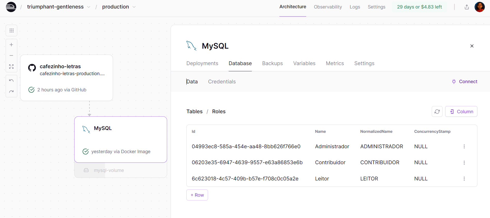
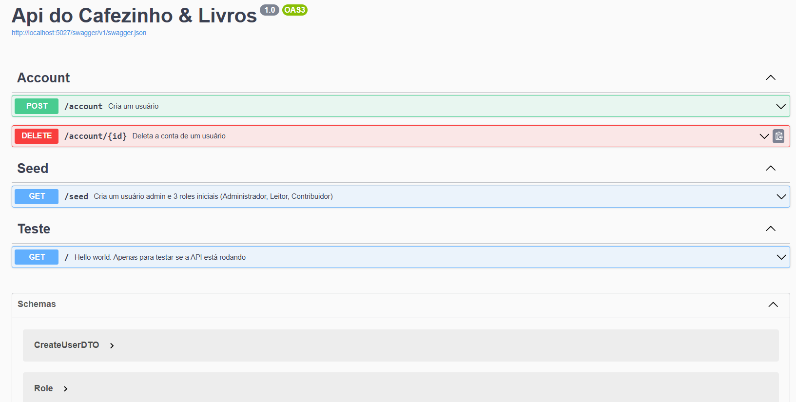

## ☕ Cafézinho & Livros API

É uma rede para leitores apaixonados compartilharem suas ideias e experiências de leitura.☕📚

Projeto criado por hobby, com foco em aprendizado e boas práticas — incluindo Docker, Entity Framework, MySQL e Deploy no Railway.

### 🚀 Tecnologias

- .NET 8
- Entity Framework Core
- MySQL
- Docker
- Swagger
- Railway (deploy da API e banco)

### ⚙️ Como rodar localmente

```
#Clone o repositório
git clone https://github.com/seu-usuario/CafezinhoELivrosApi.git

# Acesse a pasta do projeto
cd CafezinhoELivrosApi

# Suba os containers
docker compose up -d

# A documentação da API estará em:
# 👉 http://localhost:5027/swagger
```

### 🖼️ Prints do Projeto
🔹 Dashboard do Railway



### 💬 Contato

Feito com ☕ por Marcella Amorim S.A.
📧 [https://www.linkedin.com/in/marcella-ananias/]
